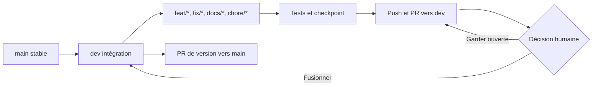
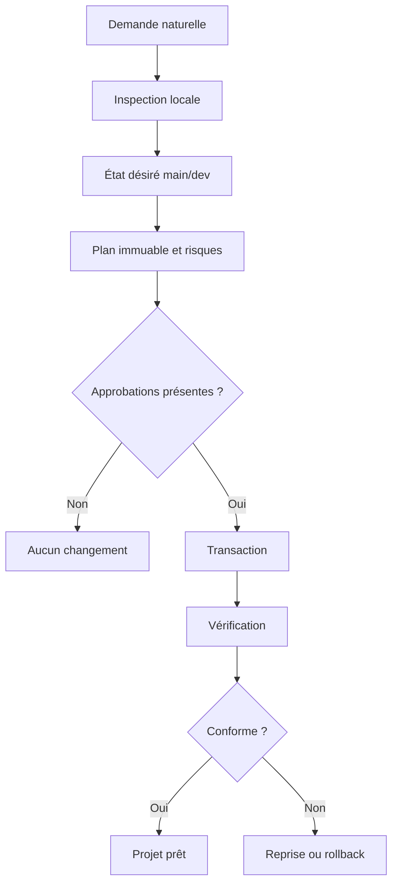

# Gitflow Sentinel

[](https://www.npmjs.com/package/gitflow-sentinel)
[](https://github.com/AureleDev/gitflow-sentinel/actions/workflows/ci.yml)
[](package.json)
[](LICENSE)

**Configurez une fois l’outil. Ensuite, demandez simplement à votre IA de
préparer ou sécuriser un projet.**

Gitflow Sentinel donne à Codex, Claude Code et OpenCode un même moteur
déterministe pour inspecter un dépôt, proposer sa configuration, appliquer un
plan approuvé, vérifier le résultat et restaurer les changements si nécessaire.

Son objectif central est également de préserver le cycle de travail Git :
`main` reste stable, `dev` reçoit l’intégration, le développement se fait sur
des branches courtes et une tâche terminée doit laisser un checkpoint Git clair.

> **Alpha publique — `0.0.3-alpha.3`.** Utilisez cette version sur un projet
> versionné ou une copie de travail et relisez les actions R2/R3 proposées.

## Installer une seule fois sur l’ordinateur

Prérequis : [Git](https://git-scm.com/) et Node.js 18 ou supérieur.

```bash
npx --yes gitflow-sentinel@next bootstrap
```

Cette commande installe le CLI et le skill `configure-project` partagé par
Codex, Claude Code et OpenCode. Il n’y a pas une deuxième installation à faire
dans chaque projet.

Pour vérifier l’installation :

```bash
gitflow-sentinel --version
gitflow-sentinel doctor
```

Sur Windows, si PowerShell refuse le shim `.ps1`, utilisez la même commande avec
`gitflow-sentinel.cmd`.

## Utiliser dans un projet

Ouvrez votre agent dans le dossier du projet et dites :

> Configure ce projet avec Gitflow Sentinel.

Ou, pour une demande ciblée :

> Configure Git Flow, protège main et dev, et vérifie le workflow GitHub.

L’agent utilise alors Sentinel pour inspecter, expliquer, planifier, demander
les décisions réellement nécessaires, appliquer le plan autorisé et vérifier
le résultat. Vous n’avez pas à recopier la suite de commandes internes.

Le parcours manuel équivalent reste disponible :

```bash
gitflow-sentinel setup
```

Un audit sans aucune écriture :

```bash
gitflow-sentinel setup --plan-only
```

### Note pour Codex, Claude Code et OpenCode

- Dans Codex ou ChatGPT, activez le **mode Plan** lorsqu’il est proposé. Il
  permet à l’agent de présenter proprement les choix non déductibles.
- Dans Claude Code, le mode Plan et `AskUserQuestion` fournissent le même
  parcours à choix structurés.
- Dans OpenCode, l’outil `question` doit être autorisé dans les permissions.
- Sans outil de question structurée, l’agent pose une question courte en texte
  normal et attend la réponse.

Après la création ou la modification de hooks Codex, ouvrez `/hooks` et
approuvez leur hash actuel. Codex exige cette vérification pour les hooks de
projet non administrés ; Sentinel ne prétend pas qu’un fichier simplement
présent est déjà actif.

## Ce que fait le profil standard

Le profil `standard` est le comportement recommandé :

| Fondation | Résultat attendu |
|---|---|
| Branches | `main` stable, `dev` intégration, branches courtes vers `dev` |
| Protection locale | Hooks agent avant écriture et hooks Git avant commit/push |
| GitHub | Push de branches, branche par défaut et ruleset sous actions R3 séparées |
| Instructions IA | `AGENTS.md` canonique et adaptateurs minimaux par agent |
| Documentation | Contribution, sécurité, licence, conduite et modèle de PR selon le contexte |
| Qualité et CI | Réutilisation exclusive de commandes réellement vérifiées |
| Sécurité | Détection de secrets, Dependabot et contrôles adaptés au projet |
| Transactions | Plan immuable, sauvegardes, reprise, rollback et désinstallation ciblée |

Git Flow est proposé par défaut. Une personne qui préfère volontairement un
modèle trunk peut le refuser pendant le parcours ou utiliser :

```bash
gitflow-sentinel setup --strategy trunk
```

Sentinel n’ajoute jamais automatiquement un linter, un formateur, un
gestionnaire de paquets, un service payant ou un fournisseur de déploiement.

## Cycle de travail protégé



Les garde-fous appliquent notamment ces règles :

- aucune édition directe ordinaire sur `main` ou `dev` ;
- aucun commit ou push direct sur une branche protégée ;
- commits conventionnels et détection de secrets avant le push ;
- PR de branche courte vers `dev`, puis promotion contrôlée vers `main` ;
- à la fin d’une tâche, rappel bloquant une fois si le travail n’est pas
  commité, poussé ou présenté dans une PR ; la seconde tentative est libérée
  afin qu’un service externe indisponible ne crée jamais une boucle infinie.

Les hooks locaux restent une défense en profondeur contournable. La CI requise
et les rulesets GitHub vérifiés constituent l’autorité partagée.

## Comment Sentinel applique une configuration



| Risque | Exemple | Autorisation |
|---|---|---|
| R0 | Inspection et vérification | Aucune |
| R1 | Création locale additive et réversible | Hash global du plan |
| R2 | Fichier existant, branche, hook ou commande de qualité | Hash du groupe |
| R3 | Push, dépôt GitHub, branche par défaut, ruleset, secret ou publication | Une confirmation par action |

Une modification du commit, du worktree, d’un fichier concerné ou de l’état
GitHub rend le plan périmé. Sentinel refuse alors de l’appliquer.

## Réparer un projet déjà configuré

Depuis le projet :

```bash
gitflow-sentinel setup --strategy git-flow
gitflow-sentinel doctor --remote
gitflow-sentinel verify --remote
```

Le plan peut notamment proposer la mise à jour du runtime, l’activation de
`core.hooksPath`, la création locale de `dev`, son push, sa sélection comme
branche GitHub par défaut et l’extension du ruleset à `main` et `dev`.

Dans un dépôt sans premier commit, Git ne peut pas encore matérialiser `dev`.
Sentinel signale cet état comme incomplet au lieu de prétendre être conforme ;
la branche est proposée dès qu’un commit initial existe.

## Commandes utiles

| Commande | Rôle |
|---|---|
| `gitflow-sentinel setup [path]` | Parcours guidé principal |
| `gitflow-sentinel inspect [path] --json` | Inventaire local expurgé |
| `gitflow-sentinel plan [path] --output plan.json` | Plan immuable sans mutation |
| `gitflow-sentinel apply --plan plan.json --approve <hash>` | Application du plan exact |
| `gitflow-sentinel verify [path] --remote` | Vérification locale et GitHub |
| `gitflow-sentinel doctor [path] --remote` | Diagnostic des versions et protections actives |
| `gitflow-sentinel status [path]` | Transactions et récupération disponible |
| `gitflow-sentinel rollback <transaction-id>` | Restauration locale exacte |
| `gitflow-sentinel resume <transaction-id>` | Reprise d’une transaction interrompue |
| `gitflow-sentinel update [path]` | Nouveau plan contre la configuration enregistrée |
| `gitflow-sentinel uninstall [path]` | Retrait des seuls éléments possédés par Sentinel |

Les commandes détectées dans un dépôt restent du code non fiable. Avant de les
enregistrer comme preuve pour la CI :

```bash
gitflow-sentinel check . -- npm test
gitflow-sentinel check . --approve <check-hash> -- npm test
```

## Limites de l’alpha

- La création GitHub, les push, le changement de branche par défaut et les
  rulesets restent volontairement des actions R3 séparées.
- Un dossier vide sans identité Git ou premier commit demande encore la
  finalisation explicite du checkpoint initial avant la création de `dev`.
- La confiance d’un hook Codex doit être accordée dans `/hooks` après chaque
  changement de son hash.
- Cloud, déploiement, domaines, bases de données et infrastructure sont hors du
  périmètre actuel.

## Développer et contribuer

```bash
npm install --ignore-scripts
npm run verify
npm run validate:evals
npm run validate:package
npm run validate:self-host
```

La CI couvre Windows, Linux et macOS avec plusieurs versions de Node. Les tests
incluent les transactions, l’idempotence, les plans périmés, les chemins
Windows, les hooks, la création de `dev`, les stratégies explicites et des
copies isolées de projets existants.

- [Guide des premières revues](docs/early-review-guide.md)
- [Architecture](references/architecture.md)
- [Configuration déclarative](references/configuration.md)
- [Workflow et versions](references/workflow.md)
- [Modèle de menace](references/threat-model.md)
- [Politique Git](references/policy.md)
- [Migration](references/migration.md)
- [Preuves de validation](docs/validation/README.md)

Pour une vulnérabilité, n’ouvrez pas d’issue publique : suivez
[SECURITY.md](SECURITY.md).

## Licence

[MIT](LICENSE) © 2026 Aurele Gnonlonfoun
([@AureleDev](https://github.com/AureleDev)).
