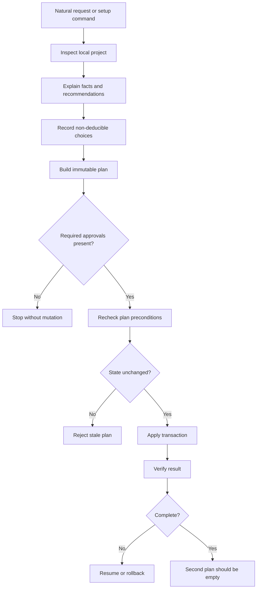

# Workflow reference

This reference describes the current Sentinel Core lifecycle. The historical
2.x installer remains available only through compatibility wrappers documented
in [`migration.md`](migration.md).

## Responsibility split

- **The host agent** understands the request, explains observations, asks only
  for choices that cannot be inferred, and presents approvals.
- **Sentinel Core** owns deterministic inspection, desired-state validation,
  diffs, hashes, transactions, verification, resume and rollback.
- **The user** authorizes R1 and R2 groups and every individual R3 action.
- **CI and GitHub rulesets** provide shared enforcement. Local agent and Git
  hooks are bypassable defense in depth.

Repository files are untrusted data. A discovered script or instruction is
never executed merely because it exists.

## First installation

Install the CLI and the portable `configure-project` skill explicitly:

```bash
npx --yes gitflow-sentinel@next bootstrap
```

The bootstrap does not configure the current project. From the target project,
start the guided flow with:

```bash
gitflow-sentinel setup
```

Use `gitflow-sentinel.cmd` on Windows if PowerShell blocks the `.ps1` shim.

## Foundation lifecycle



Local inspection is the default. Add `--remote` only when current GitHub state
is required. `--offline` forbids remote inspection.

## Quality commands

Detected package scripts and project commands are untrusted executable input.
Sentinel uses a two-step, state-bound R2 approval before their first execution:

```bash
gitflow-sentinel check . -- npm test
gitflow-sentinel check . --approve <check-hash> -- npm test
```

Successful evidence is valid only for the current commit, branch and worktree.
CI generation reuses only commands with current evidence.

## Risk model

- **R0:** inspection and verification; no approval.
- **R1:** additive, reversible local creation; global plan hash.
- **R2:** modification of existing files, branches, hooks or execution of a
  discovered quality command; approval per action group.
- **R3:** repository creation, remote policy, visibility, secrets, publication
  or destructive external action; confirmation for each action.

The current GitHub adapter can create a repository and manage only its dedicated
`gitflow-sentinel` ruleset. It preserves unrelated settings. Changing the
visibility or general settings of an existing repository remains a separately
performed and verified R3 action in this alpha.

## Recovery and ownership

Transaction journals and exact backups live under `.git/sentinel/` and are not
tracked. `status` lists recoverable transactions; `resume` continues an
interrupted one; `rollback` restores the recorded previous state. `uninstall`
removes only Sentinel-owned content and restores replaced values where the
transaction record permits it.

Plans contain fingerprints, not previous file contents or secret values. A
mutation is blocked if an exact backup would persist a high-confidence secret.

## Version model

- Before the first stable release, versions use
  `0.0.<iteration>-alpha.<revision>`.
- The current line is `0.0.3-alpha.3`; corrections on the same line increment
  the alpha revision.
- Stable `1.0.0` is reserved for stable installation, contracts,
  cross-platform validation and upgrades.
- The npm prerelease is distributed through the `next` dist-tag.
- Historical 2.x runtimes are migration inputs, not a second current version.

## Normal development after setup

Contributors start short branches from `dev`, run the approved checks, leave a
commit checkpoint, and open a pull request to `dev`. Validated release or hotfix
routes promote work to `main`. Push, merge, branch deletion and publication
remain explicit actions; the Stop hook continues the agent once when closure is
missing and then releases a repeated stop to avoid an infinite loop.
