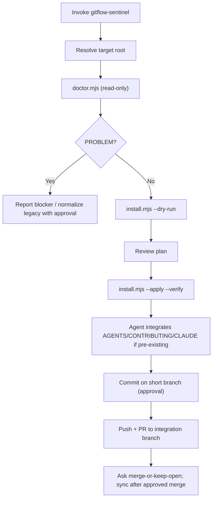
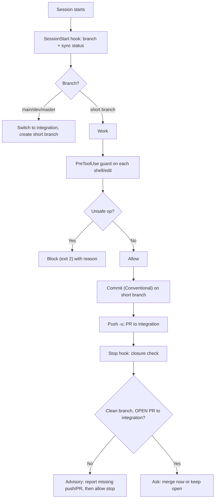

# Workflow reference

How the skill behaves end to end, and what the installed guardrails do during
normal work afterward.

## Responsibility split

- **Scripts** own deterministic checks, file installation, wiring merges, and
  scenario verification. Beyond install: `uninstall.mjs` backs the guardrails out
  cleanly (de-merges agent wirings, restores the previous `core.hooksPath`,
  strips managed snippets — never touches history), and `github-protect.mjs`
  configures GitHub server-side branch protection (run via `--github-protection`
  on the installer, or directly), the one layer that holds even when no local
  hook is present.
- **The agent** owns editorial integration of project-facing docs and any
  irreversible Git/GitHub action (commit, push, PR, merge, branch delete,
  legacy-branch normalization), each taken only with explicit approval.
- **Installed hooks** take over during daily work. The skill does not need to be
  re-invoked for ordinary tasks once a repo is set up.

## Install lifecycle

The installer refuses an unsafe `--apply` (protected/legacy/dirty/missing
branches). That gate is intentional: installing guardrails should itself respect
the guardrails.

The installer also wires post-clone auto-activation: it adds
`node .gitflow-sentinel/activate.mjs` to `package.json`'s `"prepare"` so a fresh
clone re-arms the native `core.hooksPath` on the next install (the trick husky
uses). When husky already owns `core.hooksPath`, gitflow-sentinel is injected
into the existing `.husky/*` hooks instead of taking the path over. On a non-Node
repo, run `node .gitflow-sentinel/activate.mjs` once after cloning.

## Daily work (after install)

## Version model

- Before the first stable release, public product versions use
  `0.0.<iteration>-alpha.<revision>`. The current line is `0.0.3-alpha.1`;
  subsequent corrections on the same line increment the alpha revision.
- A stable `1.0.0` is reserved for the point where installation, contracts,
  cross-platform validation and upgrade behavior are declared stable.
- `.gitflow-sentinel/VERSION` is aligned with the package version. The
  SessionStart hook compares it with an available installed CLI and warns on
  drift; the doctor performs the same comparison during an explicit audit.
- Bump it when the engine, hooks, or wiring change in a way repos should detect,
  then re-run install to upgrade managed files in place (advisory docs are left
  to the agent).
- Historical 2.x runtimes remain migration inputs. Sentinel Core aligns package and runtime
  versions so a project no longer exposes two unrelated current version lines.

## Idempotence

- Managed files carry a `managed-by: gitflow-sentinel` marker and are overwritten
  on upgrade; unmanaged files with the same name are backed up first.
- Wiring files (`.codex/hooks.json`, `.claude/settings.json`) are **merged**:
  our entries are replaced by command, everything else is preserved.
- `.gitflow-sentinel.json` is **never** overwritten once it exists — it is the
  team's owned policy.
